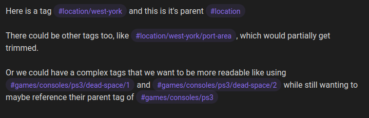
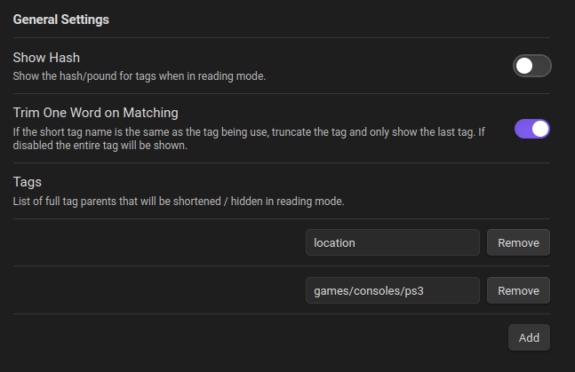

# Tag Formatter

A configurable obsidian plugin that changes the way tags are displayed in preview mode.

## v0.1.0 Features

- Hide the "#" on tags.
- Hide selected parents on nested tags.

Preview

Editor

Settings

