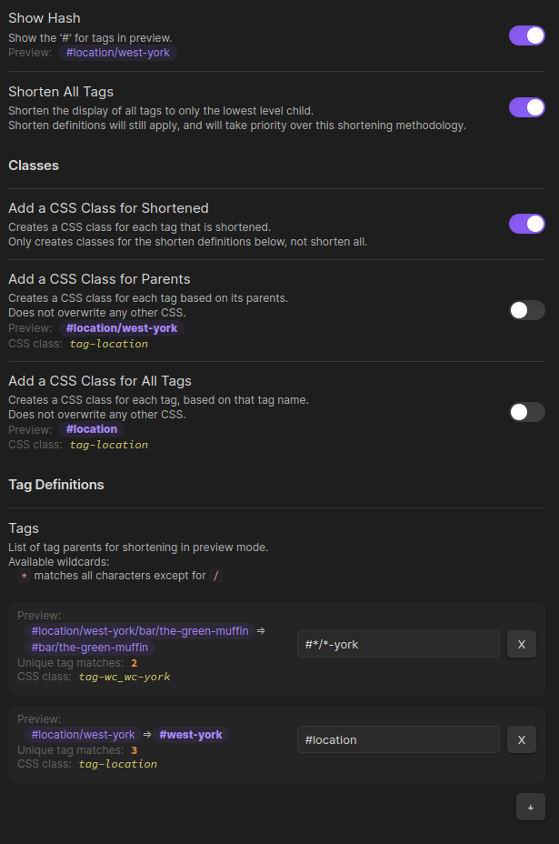

# Tag Formatter

A configurable obsidian plugin that changes the way tags are displayed in preview mode.

Preview

Editor

Settings

## v0.1.5 Features

- Hide the "#" on tags.
- Hide parents for all nested tags.
- Hide all parent tags.
- Hide portions of tags based on a pattern.
- Add CSS class for every shortened tag (per definitons).
- Add CSS class for every tag based on parents.
- Add CSS class for all tags.
